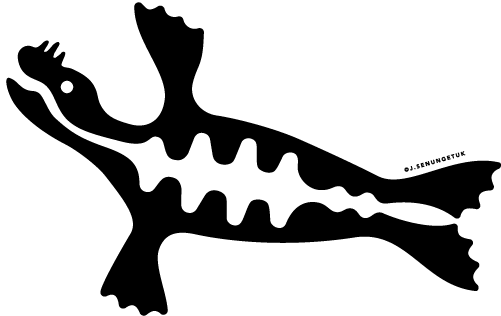

  
  

# NNA Community Research Handbook

The Navigating the New Arctic (NNA) Community Handbook is a collaborative tool for people conducting research in the Arctic share knowledge about doing collaborative, regenerative and redistributive, and better research.

## Level of Support

* This repository is is a collaborative effort and not directly supported by NSIDC.  We welcome issue submissions and
  pull requests in order to foster community contribution.

See the [LICENSE_GENERAL.md](LICENSE_GENERAL.md) for details on permissions and warranties. Please contact
nsidc@nsidc.org for more information.

## Requirements

TBD but most likely built using `quarto`

## Troubleshooting

{troubleshooting}

## Credit

This content was developed by the NNA and Arctic research community with funding from
multiple sources.
